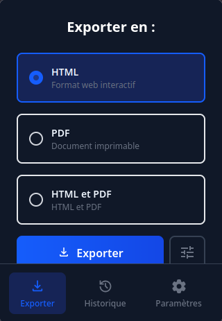
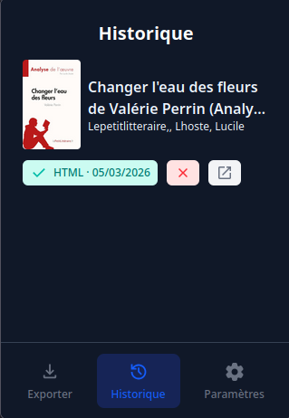
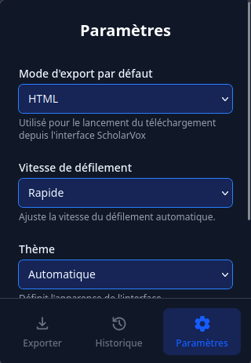
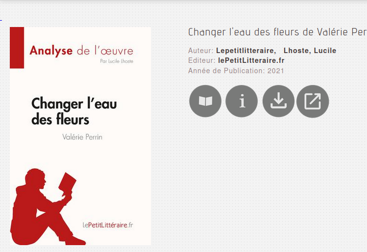

  

  <h3 align="center">ScholarVox Univ Downloader Extension</h3>
  

## Overview
This browser extension is designed for users with access to a ScholarVox Univ instance, a platform for French students and academics. The extension allows you to save documents for offline use, overcoming the limitations of the native viewer, which does not support direct HTML downloads or PDF printing without daily quotas. With this extension, you can easily export books for personal use.
## Building from source
Simply run `npm install` and then `npm run build`. It will create a `build` folder when you can find the extension.
## Features
- **From the Viewer:**
  - Download books as PDF, HTML, or both
  - Specify the pages you want to export
  - **Note:** Due to Firefox limitations, silent PDF printing is not possible. You will need to confirm the print dialog if you choose PDF export.
- **From Book Presentation and Search Pages:**
  - Open the viewer in a new tab (not a new window)
  - Download the entire book in HTML while you continue other tasks
- **General Features:**
  - Download history
  - Adjustable scroll speed and zoom
  - Set the maximum number of simultaneous downloads via a queue

## How It Works
The extension downloads each page of a book individually and captures network requests to fetch related resources like fonts. It simulates the behavior of a user reading the entire book in one go.

## Usage Guidelines & Risks
- **Safe Usage:**
  - With default settings, using the extension is safe as long as you do not download more than 3-4 books per day. Downloading more may appear suspicious (after all, who reads more than 4 full books a day?).
  - You can adjust scroll speed and zoom to speed up exports, but ensure each page is displayed at least once. Excessive speed may also trigger suspicious activity.
- **Intended Use:**
  - This extension is for personal use only. Mass downloading for redistribution (e.g., uploading to Z-Lib) is strictly prohibited.
  - If discovered, your account may be disabled, your institution could face issues, and agreements between the Couperin consortium and publishers could be jeopardized, affecting all institutions.

## Screenshots & Demo
Everyone loves screenshots! Here are some examples:

A video demonstration is also available:

<video width="640" height="360" controls>
  <source src="./docs/screenshots/video.mp4" type="video/mp4">
  Your browser does not support the video tag.
</video>

## Disclaimer
This extension is intended for personal, non-commercial use only. Please respect the terms of service of your institution and ScholarVox Univ. Misuse may result in account suspension and broader consequences for your institution and the academic community.

---

*For more information, see the French user documentation in `docs/users.md`.*
